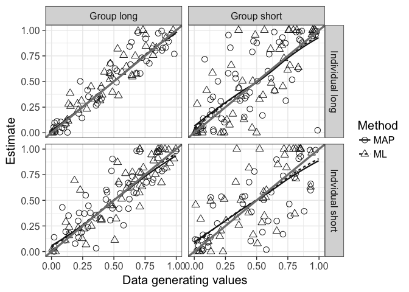
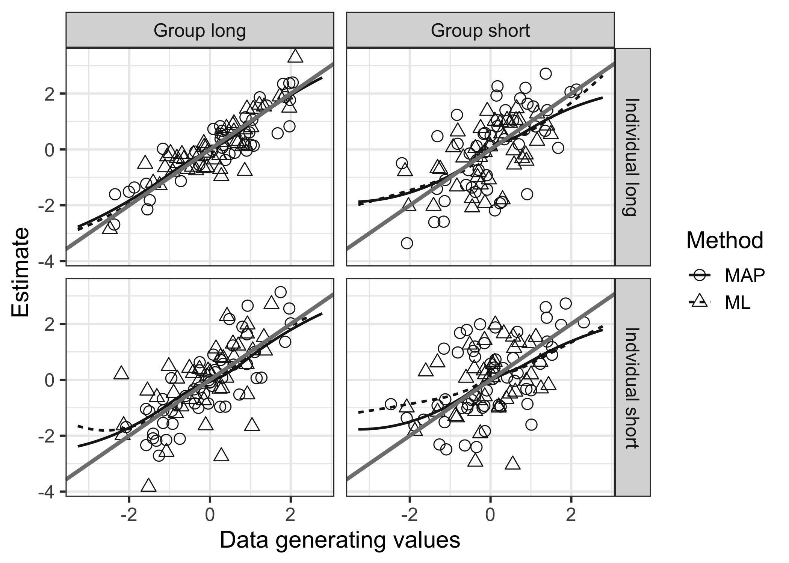

### Demo of scirt usage

This code reproduces the simulation study reported in Halpin P. F. and Bergner, Y. (2017) *Psychometric models for small group collaborations.* Please contact me at `peter.halpin@nyu.edu` with questions or feedback.

Note that the functions in this package currently do not check for or catch invalid arguments and will break (ungracefully) if the inputs are not formatted as described in this example. Future versions of the package will address these issues, but for now it's user beware.

Set up sesssion.

``` r
# devtools::install_github("peterhalpin/scirt") # install package
library(scirt)
```

The data-generating item paramers for the simulation are loaded with the package as the data.frame `sim_parms`. The columns are the discrimination (`alpha`) and difficulty (`beta`) parameters of the 2PL model. These naming conventions are required for all `parms` arguments in this package. There are 100 items on the groups test, each including the `"COL"` suffix in the row names. There are 100 items on the individual test, each including the `"IND"` suffix in the row names. The use of the `"IND"` and `"COL"` tags for items is required for all functions that expect a combined assessment (they are not necessary for functions that use either the individual test or collaborative test separately).

``` r
sim_parms[c(1:2, 100:102, 200), ]
```

    ##                 alpha      beta
    ## item1_COL   1.6031248 -2.817971
    ## item2_COL   1.3161236 -2.792798
    ## item100_COL 1.0459237  2.843536
    ## item1_IND   1.3385670 -2.838862
    ## item2_IND   0.7310759 -2.624016
    ## item100_IND 0.7651154  2.773532

The data.frame `sim_data` contains the generated item responses, along with information about the groups. For more information on data generation see `help(data_gen)` or inspect the source code of that function.

The first five colums of `sim_data` indicate

1.  which dyad
2.  which sample from each dyad (in this case there is only one sample per dyad, although multiple can be generated)
3.  the data-generating value of the RSC weight of each dyad
4.  the data-generating values of the latent trait of member 1
5.  the data-generating values of the latent trait of member 2

Columns `6:105` contain the responses to the group test, and columns `106:205` contain the responses to the individual test.

For any function taking item response data as an argument (`resp`) in this package, the columns containing response data for each test form *need to be in the same order* as they appear in the rows of the `parms` argument (here, `sim_parms`).

Additionally, each odd row of the item reponse data matrix for a combined assessment must contain the data for member 1 of a dyad, and the subsequent even row must contain the data for member 2 of that dyad. Note that for all columns except the responses to the individual assessment, the odd and even rows will be duplicated.

``` r
head(sim_data[c(1:7, 105:107, 205)])
```

    ##     pairs samples         w     theta1      theta2 item1_COL item2_COL
    ## 1       1       1 0.9620921  0.3914314 -0.50999406         1         1
    ## 1.1     1       1 0.9620921  0.3914314 -0.50999406         1         1
    ## 2       2       1 0.7843039 -1.0496464  0.04600715         1         1
    ## 2.1     2       1 0.7843039 -1.0496464  0.04600715         1         1
    ## 3       3       1 0.4895265 -1.0088282 -0.65624967         1         1
    ## 3.1     3       1 0.4895265 -1.0088282 -0.65624967         1         1
    ##     item100_COL item1_IND item2_IND item100_IND
    ## 1             1         0         1           0
    ## 1.1           1         1         1           0
    ## 2             0         1         1           0
    ## 2.1           0         1         1           0
    ## 3             0         1         0           0
    ## 3.1           0         1         0           0

Lastly, we have some additional data-generating parameters for the simulation.

``` r
n_obs <- 1000 # n respondents
K <- n_obs/2 # n groups
odd <- seq(1, n_obs, by = 2) # indexes odd rows of sim_data

n_items <- 100 # n items
i <- 20 # n items for short form

ind_names <- row.names(sim_parms)[grep("IND", row.names(sim_parms)) ] # individual test
ind_names_short <- ind_names[sample(n_items, i)] # short form for individual test

col_names <- row.names(sim_parms)[grep("COL", row.names(sim_parms)) ] # group test
col_names_short <- col_names[sample(n_items, i)] # short form for group test
```

The function `est_RSC` estimates the RSC model from a combined assessment. It also returns estimates of individual abiltiy based on the individual component of the assessment. Standard errors are computed by numerically inverting either the expected (default) or observed Hessian at the solution. See `help(est_RSC)` for more details.

The following chunk runs `est_RSC` in each of the four test length conditions obtained by crossing the long (100 items) and short (20 items) forms. Note that for the short forms, results will differ slightly from those reported in the paper due to random sampling of items.

The runtime for the long-long condition (200 items with 1000 respondents) is about 90 seconds for each estimator with a 2.4 GHz Intel Xeon (single core). For this sample size, parallelization (via `parallel:mclapply`) is acutally slower than for a single core; however, the `parallel` option of `est_RSC`can lead to significant improvements in runtime for very large samples (e.g., when bootstrapping). If you don't want to wait around for this to run, try using a subset of rows from `sim_data` (keeping in mind that for every odd row `m` the row `m + 1` must also be selected).

``` r
# long group test, long individual test
ll_items <- c(col_names, ind_names)
ml_ll <-  est_RSC(sim_data[ll_items], sim_parms[ll_items, ], method = "ML")
map_ll <- est_RSC(sim_data[ll_items], sim_parms[ll_items, ], method = "MAP")

# long group test, short individual test
ls_items <- c(col_names, ind_names_short)
ml_ls <-  est_RSC(sim_data[ls_items], sim_parms[ls_items, ], method = "ML")
map_ls <- est_RSC(sim_data[ls_items], sim_parms[ls_items, ], method = "MAP")

# short group test, long individual test
sl_items <- c(col_names_short, ind_names)
ml_sl <-  est_RSC(sim_data[sl_items], sim_parms[sl_items, ], method = "ML")
map_sl <- est_RSC(sim_data[sl_items], sim_parms[sl_items, ], method = "MAP")

# short group test, short individual test
ss_items <- c(col_names_short, ind_names_short)
ml_ss <-  est_RSC(sim_data[ss_items], sim_parms[ss_items, ], method = "ML")
map_ss <- est_RSC(sim_data[ss_items], sim_parms[ss_items, ], method = "MAP")
```

The rest of this document sets up `ggplot2` to reproduce Figure 1 and Figure 2 from the paper.

``` r
library(ggplot2)
gg <- rbind(ml_ll, map_ll, ml_sl, map_sl, ml_ls, map_ls, ml_ss, map_ss)
gg$ind_form <- rep(c("Individual long", "Indvidual short"), each = K*4)
gg$col_form <- rep(c("Group long", "Group short"), each = K*2) %>% rep(times = 2)
gg$Method <- rep(c("ML", "MAP"), each = K) %>% rep(times = 4)
gg$dgp_w <- rep(sim_data$w[odd], times = 8)

gg$sample <- 0
gg$sample[sample(nrow(gg), nrow(gg)/10)] <- 1

p <- ggplot(gg, aes(x = dgp_w, y = w, group = Method)) +
      geom_point(data = gg[gg$sample == 1,], size = 3, aes(shape = Method, color = Method)) +
      geom_smooth(se = F, size = .8, aes(linetype = Method, color = Method)) +
      scale_color_manual(values = c("grey10", "grey10")) +
      scale_shape_discrete(solid=F) +
      xlab("Data generating values") +
      ylab("Estimate")  +
      geom_abline(slope = 1, intercept = 0, col = "grey50", size = 1.2) +
      theme_bw(base_size = 15)

p + facet_grid(ind_form ~ col_form)
```

    ## `geom_smooth()` using method = 'loess'



``` r
q <- ggplot(gg, aes(x = w, y = w_se, group = Method)) +
      geom_point(data = gg[gg$sample == 1,], size = 3, aes(shape = Method, color = Method)) +
      geom_smooth(se = F, size = .8, aes(linetype = Method, color = Method)) +
      scale_color_manual(values = c("grey10", "grey10")) +
      scale_shape_discrete(solid=F) +
      xlab("Estimate") +
      ylab("Standard error")  +
      theme_bw(base_size = 15)

q + facet_grid(ind_form ~ col_form)
```

    ## `geom_smooth()` using method = 'loess'


